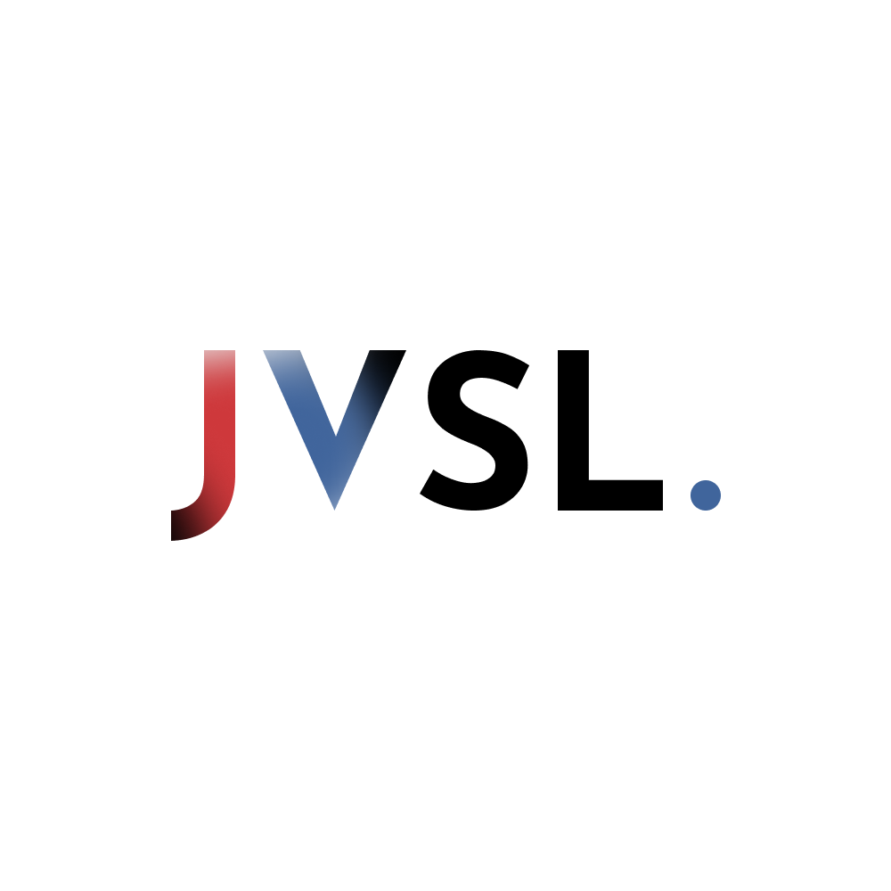
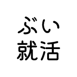
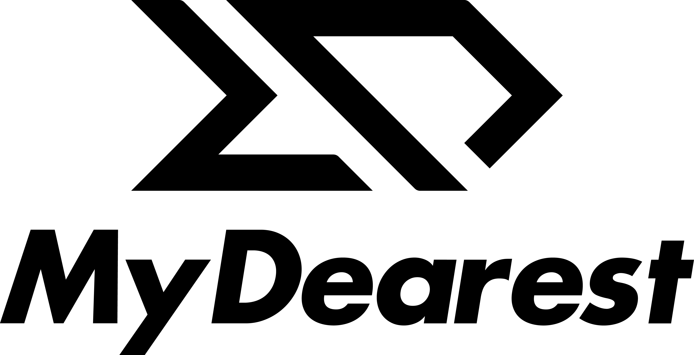

# コミュニティパートナー

 Iwaken Lab. <a href="https://x.com/iwakenlab">X</a>, <a href="https://www.iwakenlab.jp/">Web</a>
 

 JVSL/日本仮想学生連盟 <a href="https://x.com/jvs_league">X</a>, <a href="https://jvs-league.org">Web</a>
 

 VRC就活生集会   <a href="https://shukatsu.niri.la/">Web</a>
 

引き続き募集中です。ぜひ詳細をご覧ください（[**コミュニティパートナーのご提案**](https://docs.google.com/document/d/1fRopOzXi3gOGB2VX_L3UtF169KQKv_H-M4_7WLwzWf4/edit?tab=t.rpkidpq6gd8l)）。

# 企業協賛
絶賛募集中です。協賛しやすいように2種類の協賛パッケージをご用意しております。ぜひ詳細をご覧ください（[**企業協賛のご提案**](https://docs.google.com/document/d/1fRopOzXi3gOGB2VX_L3UtF169KQKv_H-M4_7WLwzWf4)）。

<!-- ## イベントスポンサー
### GOLD Sponsor

### BASIC Sponsor -->

## コミュニティサポーター

### SILVER Supporter

 MyDeaerst 株式会社 <a href="https://x.com/MyDearest_corp">X</a>, <a href="https://mydearestvr.com/">Web</a>
 

# 個人協賛
絶賛募集中です。1000円からの協賛プランをご提供させていただいております。ぜひ詳細をご覧ください（[**個人協賛のご提案**](https://docs.google.com/document/d/1fRopOzXi3gOGB2VX_L3UtF169KQKv_H-M4_7WLwzWf4/edit?tab=t.lttsirvd0t9f)）。
<!-- ## 松

## 竹

## 梅 -->

# 協力・協賛を募集しています！
NUMAでは、協賛してくださる企業・個人や、コミュニティパートナーとなってくれる団体を募集しています（[**NUMA パートナー・協賛のご提案**](https://docs.google.com/document/d/1fRopOzXi3gOGB2VX_L3UtF169KQKv_H-M4_7WLwzWf4/edit?usp=sharing)）。ぜひ、ご検討のほど、よろしくお願いいたします。

NUMAの加盟団体一覧はこちら: [**NUMA about us**](/members/)